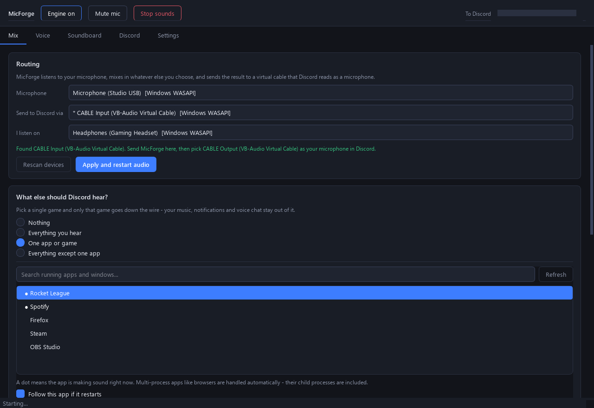
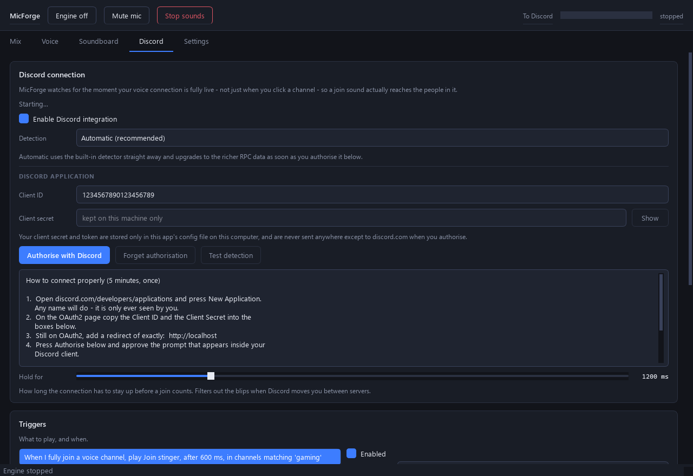
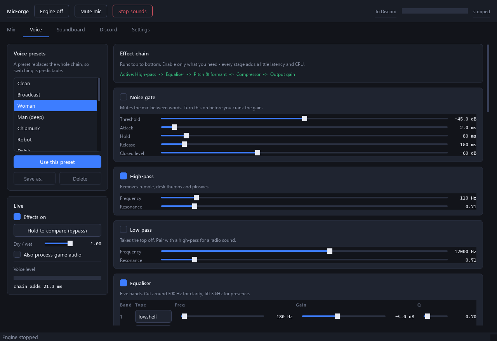
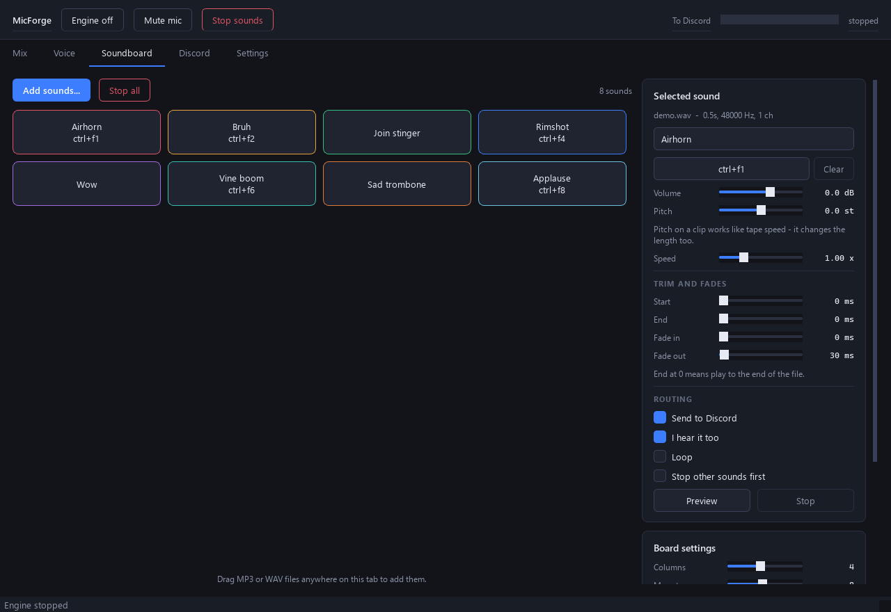

# MicForge

Route your microphone, any single application's audio, and a soundboard into one
virtual microphone — so everyone in your Discord call hears exactly what you want
them to. With a real voice changer on top.

Windows and Linux. Python, MIT licensed.



---

## What it actually does

**Share one game's sound, not your whole desktop.** Most "stereo mix" setups send
everything — your music, your notifications, the voice call itself echoing back.
MicForge can capture a *single process tree* instead, so your friends hear the game
and nothing else. There is also an inverse mode: capture everything *except* one app
(usually Discord, to avoid the echo).

**A soundboard that plays through your mic and your headphones.** Every clip routes
to the virtual mic and to your own monitor independently, with per-clip volume,
pitch, trim, fades, looping and a global hotkey.

**Sounds that fire when you actually join a voice channel.** Not when you click the
channel — when your voice connection is genuinely live and people can hear you.
Those are different moments, usually a second or two apart, which is why join sounds
so often play into an empty room.

**A voice changer with independent pitch and formant control.** Which is what makes
the difference between a convincing voice and a chipmunk. Twenty presets included:
Woman, Man (deep), Robot, Dalek, Demon, Alien, Walkie-talkie, Telephone, Megaphone,
Cave, Ghost, Underwater, Giant, Broken radio and more — all of them just starting
points for the fifteen effects underneath.

---

## Install

Python 3.10 or newer.

```bash
git clone https://github.com/bearylaw/tool-micforge-audio-router-desktop.git
cd tool-micforge-audio-router-desktop
python -m venv .venv
```

Windows:

```bash
.venv\Scripts\activate && pip install -r requirements.txt && python -m micforge
```

Linux:

```bash
source .venv/bin/activate && pip install -r requirements.txt && python -m micforge
```

Check everything the app depends on without launching the window:

```bash
python -m micforge --check
```

---

## Setting up the virtual microphone

This is the one step that needs something outside the app, and only on Windows.

**Windows.** An ordinary program cannot present itself to the system as a microphone
— that takes a kernel driver. So install [VB-CABLE](https://vb-audio.com/Cable/)
(free), reboot, and then:

1. In MicForge, set **Send to Discord via** → `CABLE Input (VB-Audio Virtual Cable)`
2. In Discord → Settings → Voice & Video, set **Input Device** → `CABLE Output (VB-Audio Virtual Cable)`
3. Set **I listen on** in MicForge to your headphones — never to the cable, which
   would feed straight back into itself

VoiceMeeter works too if you already have it installed.

**Linux.** Nothing to install. PipeWire and PulseAudio can both do this natively, so
press **Create virtual microphone** on the Mix tab. MicForge loads a null sink plus
a remapped source and `MicForge Virtual Microphone` appears in Discord's input list.
The modules are reused rather than stacked, so pressing it twice will not leave you
with five identical microphones.

---

## Capturing one app


Pick **One app or game**, then choose it from the list. A dot marks anything making
sound right now, so the game you just alt-tabbed out of is at the top.

On Windows this uses the process-loopback API added in Windows 10 version 2004
(build 19041). Nothing else on your system is captured — verified by test: with a
tone playing in one process, capturing that process yields 440 Hz energy of `0.061`,
excluding it yields `0.00007`, and whole-desktop capture yields `0.159`.

Multi-process apps (browsers, launchers, most modern games) are handled — the whole
process tree is captured, not just the one PID. **Follow this app if it restarts**
re-binds by executable name, so closing and reopening a game does not mean picking it
again.

On older Windows builds the app falls back to whole-desktop capture and tells you so.
On Linux, the target's stream is moved onto a private sink whose monitor is recorded,
with a loopback back to your speakers so you still hear it.

---

## Discord triggers



Two detection paths, and **Automatic** uses whichever is available:

**Built-in detector — no setup at all.** Watches for Discord holding a UDP socket
open to a voice server. Gives you working *join* and *leave* triggers immediately.
It cannot tell you which channel you joined or who else is in it.

**Discord RPC — five minutes of setup, much richer.** Create an application at
[discord.com/developers](https://discord.com/developers/applications), paste the
Client ID and Client Secret into the Discord tab, add `http://localhost` as an OAuth2
redirect, and press Authorise. Now you get channel names, per-channel filters, who
joined or left, mute and deafen events, and the exact moment the voice connection
goes live.

> The `rpc` scope is normally allow-listed by Discord, but an application's **owner**
> can always use it on their own account. Since you create your own application here,
> it works without applying for anything.

Available events:

| Event | Built-in detector | RPC |
|---|:-:|:-:|
| I fully join a voice channel | ✅ | ✅ |
| I leave a voice channel | ✅ | ✅ |
| I move to a different channel | — | ✅ |
| I mute / unmute / deafen / undeafen myself | — | ✅ |
| Someone joins or leaves my channel | — | ✅ |
| Someone starts or stops speaking | — | ✅ |

Each trigger has its own delay, cooldown, volume, and optional channel and user
filters. The delay matters: Discord reports the connection as live a beat before the
other end is really receiving you, so ~600 ms is a good default. The cooldown stops a
flaky connection turning your join sound into a machine gun.

**Why "fully connected" is the right signal.** Joining a channel is a sequence:
`VOICE_CHANNEL_SELECT` fires the moment you click, then Discord walks through
`AWAITING_ENDPOINT`, `AUTHENTICATING`, `CONNECTING` and `ICE_CHECKING` before reaching
`VOICE_CONNECTED`. Only the last one means audio will be heard. MicForge waits for it,
and then holds it for a configurable period (default 1.2 s) to filter out the brief
reconnects Discord does when it moves you between voice servers.

---

## The voice changer



Fifteen effects, all reorderable, all with every parameter exposed:

noise gate · high-pass · low-pass · 5-band parametric EQ · **pitch & formant** ·
robot · ring modulator · bitcrusher · distortion · chorus · vibrato · tremolo ·
delay · reverb · compressor · output gain

The pitch stage is a phase vocoder with a cepstrally-smoothed spectral envelope, which
means pitch and formants move **independently**:

| Pitch | Formant | Result |
|---|---|---|
| +5 st | 0 | Higher, but same vocal body. Natural, still recognisably you. |
| +5 st | +5 st | The classic chipmunk — the envelope rides along with the pitch. |
| +4 st | +3 st | Convincingly feminine. |
| −5 st | −2 st | Big villain voice. |
| 0 | +7 st | Same note, completely different person. |

That distinction is the whole reason this is a phase vocoder and not a ten-line
modulated delay. The vocal tract resonances are what your ear reads as *who is
speaking*; the pitch is only *what note*.

A limiter sits at the end of the chain and cannot be bypassed by accident — clipping
into Discord sounds far worse than a few dB of gain reduction, and the point of the
app is that people turn the gain up.

---

## Soundboard



Drag MP3, WAV, OGG, FLAC, M4A or Opus files onto the tab. Per clip: volume, pitch,
speed, start/end trim, fade in/out, loop, a global hotkey, a pad colour, whether it
goes to Discord, whether you hear it, and whether it stops everything else first.

**Ducking** pulls the game audio (and optionally your voice) down while a clip plays,
so the clip is actually audible rather than buried.

Pitch on a clip works like tape speed — it changes the length too, which is what a
pitch knob on a sample is expected to do.

---

## Command line

```bash
python -m micforge                  # the window
python -m micforge --headless       # routing and triggers, no UI
python -m micforge --check          # self-test the whole audio path
python -m micforge --list-devices   # every input and output, with host APIs
python -m micforge --list-sources   # what can be captured right now
python -m micforge --list-sounds    # configured soundboard entries and their ids
python -m micforge --play Airhorn   # fire one sound and exit
```

`--play` is the escape hatch for Wayland, where the compositor blocks global hotkeys:
bind the command in your desktop's own keyboard settings.

---

## How it works

```
microphone ──► gain ──► voice chain ─┐
                                     │
loopback capture ──► gain ───────────┼──► duck ──► sum ──► limiter ──► virtual mic
                                     │
soundboard (mic bus) ────────────────┘

soundboard (monitor bus) + optional mic/capture ──────────────────► your headphones
```

There are up to four independent clocks in play — microphone, loopback capture,
virtual cable, headphones — and no two of them tick together. So the mix does **not**
run inside an output callback. Every source writes into a ring buffer, one thread
mixes at a steady rate into two more, and each output callback drains its own ring
with drift correction, dropping or repeating a handful of frames when the fill level
strays. The cost is about one extra block of latency; the benefit is that any device
can appear, vanish, or run at its own sample rate without glitching the rest.

End-to-end latency is roughly 20–30 ms at the default 5 ms buffer, plus whatever the
active effects add (the pitch shifter is the expensive one, at about 21 ms).

On Windows, PortAudio cannot do loopback capture at all, so WASAPI is driven directly
through `ctypes` — including a hand-written COM vtable for the
`IActivateAudioInterfaceCompletionHandler` that `ActivateAudioInterfaceAsync`
requires, since ctypes cannot implement a COM interface on its own. That is
`micforge/audio/wasapi.py`, and it is the most interesting file in the repository.

---

## Known limits

- **Windows needs VB-CABLE.** No userland program can register itself as a recording
  device; that requires a signed kernel driver. Linux needs nothing.
- **Per-app capture needs Windows 10 build 19041+.** Older builds fall back to
  whole-desktop capture, and the app says so rather than pretending.
- **Wayland blocks global hotkeys.** Use `--play` with your compositor's own
  shortcuts. X11 is fine.
- **The built-in Discord detector cannot name channels.** It only knows that a voice
  connection exists. Set up RPC if you want channel filters.
- **Everything is mixed in mono internally.** Discord transmits mono anyway, and it
  halves the DSP cost.
- **Exclude mode is Windows-only.** On Linux the app captures the named application
  instead and tells you.

---

## Development

```bash
pip install -e ".[dev]"
pytest -q                        # 131 tests, no audio hardware needed
ruff check micforge
python docs/make_screenshots.py  # regenerate the README images from demo data
```

The test suite runs entirely offline. It covers the DSP (length preservation,
block-size independence, pitch-shift accuracy in Hz, limiter ceilings, gate
behaviour), config round-trips and migration, ring-buffer overflow and drift
correction, resampler frequency accuracy, soundboard playback and voice stealing, and
the trigger rule engine including cooldowns and filters.

Block-size independence is the property worth knowing about: the same audio pushed
through a stage in 240-frame and 480-frame blocks must produce identical output. It
is what breaks first when a stage keeps its state wrong, and it caught four real bugs
during development.

### Your data

The config file — which holds your Discord client secret and OAuth token if you set
those up — lives in `%APPDATA%\MicForge` on Windows and `~/.config/micforge` on
Linux. It never leaves your machine. The only network request the app ever makes is
the OAuth token exchange with `discord.com`, and only when you press Authorise.

---

## License

MIT — see [LICENSE](LICENSE).
